# Super Nintendo LoROM Cartridge without Save

[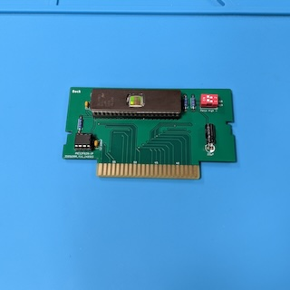](images/Cartridge.jpg?raw=1)

This repository contains the KiCad project and Gerber files for a Super Nintendo
LoROM Cartridge without Save functionality that allows to create replica
cartridges using 27C400, 27C800 and 27C160 EPROMS. When you have SNES
cartridge images (usually SFC files), you can burn one or more of them onto the
EPROM (depending on the size), and use the cartridge on your SNES like a normal
cartridge.

What is a LoROM cartridge, and how do you know that a given cartridge image
needs a LoROM cartridge PCB? Well, there are three types of SNES cartridges,
LoROM, HiROM and ExHiROM. Most cartridge images have a header that specifies
the type of cartridge (a notable exception are the test cartridges, which are
both LoROM cartridges, but do not have a header). There are software tools out
there that allow you to view the information in the cartridge image, and you
can use such a tool to determine whether this is image needs a LoROM, HiROM or
ExHiROM cartridge PCB.

## Ordering the PCB

The subdirectory "gerber-files" contains a Zip file you can use to order the PCB
from PCB manufacturers like PCBWay or JLCPCB. Simply upload the Zip on their web
page.

> [!IMPORTANT]
> SNES cartridges have a thickness of 1.2mm, not the default thickness of 1.6mm!
> Make sure that you order your PCBs with a thickness of 1.2mm. I also recommend
> to order a surface finish of ENIG with gold fingers and chamfered edges,
> because it is much more durable than the default HASL finish.

## Building the Adapter

### Bill of Materials

* __1x 27C400, 27C800 or 27C160 EPROM__.

  This is where you store your cartridge images. 27C400 have a capacity of
  512 KiB, 27C800 a capacity of 1 MiB, and 27C160 a capacity of 2 MiB.

* (Optional) __1x 42 Pin Socket 2.54mm pitch 15.42mm width__.

  This is the socket for the EPROM. It is optional, you can also solder the
  EPROM directly to the PCB, but I prefer to use sockets. Keep in mind that the
  cartridge will not fit into a cartridge shell when you use sockets.

* __1x PIC12F629-I/P DIP-8__.

  This microcontroller simulates the CIC chip that is required on SNES
  cartridges. When powering on the console, the SNES communicates with this
  chip and starts the cartridge only when it is convinced that there is a
  legit CIC chip on the cartridge. This was a security scheme enforced by
  Nintendo to make sure that only properly licensed cartridges worked on the
  SNES. Today, this scheme is cracked, and we use this PIC instead of a real
  CIC.

* (Optional) __1x 8 Pin Socket 2.54mm pitch 7.62mm width__.

  This is the socket for the PIC12F629. It is optional, you can also solder the
  PIC directly to the PCB.

* __2x 100nF Ceramic Capacitors__.

  These are the decoupling capacitors for the EPROM and the PIC.

* __1x 22&mu;F Electrolytic Capacitor__.

  Another capacitor that improves the power supply for the ICs on the cartridge.

* (Optional) __3x 10kOhm Resistors__.

  Three pull-up resistors, one for the "/PAIR" input of the PIC (required), and
  two for the address lines A18 and A19 which get switched by the DIP switch
  (optional, only required when you actually install the DIP switch).

* (Optional) __1x DIP Switch 2 Pin__.

  This DIP switch is optional, it allows you to put multiple (up to four) images
  onto the cartridge and select one of them by switching the address lines A18
  and A19 of the EPROM. When you plan to put only one image onto the cartridge,
  you do not need this DIP switch and its two corresponding pull-up resistors,
  instead close two corresponding jumpers on the other side of the PCB.

### Soldering the Socket for the EPROM (U1)

Start with soldering the large 42 pin socket for the EPROM (U1). This socket is
optional, you can also solder the EPROM directly to the PCB, but I prefer to use
sockets. Keep in mind that the cartridge will not fit into a cartridge shell
when you use sockets.

When you solder the EPROM directly to the PCB, you have program it before doing
so! See below for more information.

Make sure the the little notch of the socket is aligned with the the litte notch
on the silk screen (to the right in the image below).

[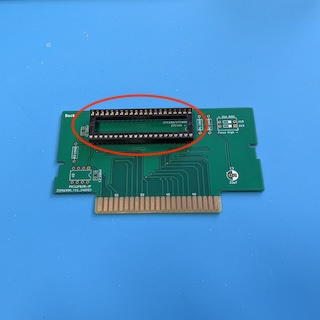](images/EPROM_Socket.jpg?raw=1)

### Soldering the Socket for the PIC12F629 (U2)

Now solder the small 8 pin socket for the PIC12F629 (U2). This socket is also
optional, you can also solder the PIC directly to the PCB.

When you solder the PIC directly to the PCB, you have program it before doing
so! See below for more information.

Make sure the the little notch of the socket is aligned with the the litte notch
on the silk screen (to the right in the image below).

[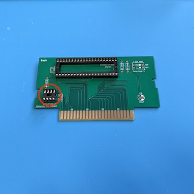](images/PIC_Socket.jpg?raw=1)

### Soldering the Decoupling Capacitors C1 and C2

Solder the two decoupling capacitors C1 and C2 for the EPROM and the PIC.

[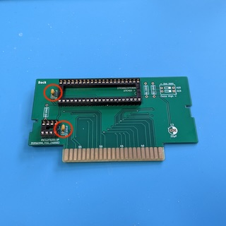](images/Decoupling_Capacitors.jpg?raw=1)

### Soldering the Pullup Resistors R1, R2 and R3

Solder the three pullup resistors R1, R2 and R3. R1 and R2 are the pullup
resistors for the address lines A18 and A19. They are optional, you only need to
install them when you install the DIP switch (see next step for more
information). R3 is the pullup resistor for the "/PAIR" input of the PIC and is
required.

[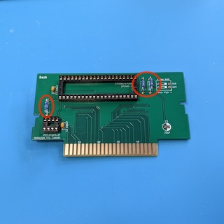](images/Pullup_Resistors.jpg?raw=1)

### Soldering the DIP Switch

The DIP switch is optional, it is only required when you plan to put more than
one cartridge image onto the EPROM. When you install it, you also have to
install the pullup resistors R1 and R2. When you do not install ist, you have to
close the corresponding jumpers on the other side of the PCB with a blob of
solder.

[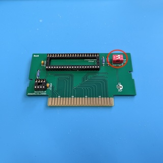](images/DIP_Switch.jpg?raw=1)
[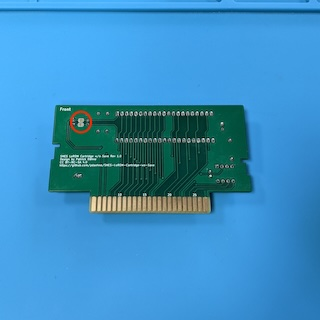](images/Jumpers.jpg?raw=1)

### Soldering the Capacitor C3

The last step is to solder the electrolytic capacitor C3. I recommend to bend
the legs of the capacitor so that it lies flat on the PCB. Keep in mind that the
orientation of this capacitors matters. The silk screen shows a small + on the
positive side of the footprint (left in the photo below), and a thick white
stripe on the negative side (right in the photo). The capacitor also has a white
stripe on its enclosure that marks the negative side. Another hint is the length
of the legs - the long leg is the positive side, and the short leg is the
negative side.

[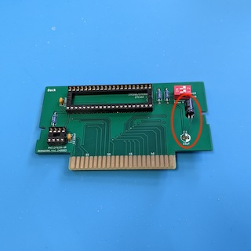](images/Electrolytic_Capacitor.jpg?raw=1)

## Programming the Firmware on the PIC12F629

[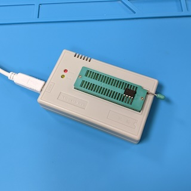](images/Programming_the_PIC.jpg?raw=1)

On each cartridge there has to be a CIC chip that proves to the console that
this is a legit cartridge licensed by Nintendo. Nowadays, this security chip is
cracked, and we can simulate it with a cheap PIC microprocessor and a special
firmware. The firmware is called "supercic", and precompiled versions
(.hex-Files) are available for download here:

https://sd2snes.de/blog/cool-stuff/supercic

The actual source code (if you are interested) is available on Github:

https://github.com/mrehkopf/sd2snes/tree/develop/cic/supercic

What you need for programming the PIC is the file "supercic-key_p12f629.hex"
inside the zip file from the first link and of course a programmer. I own the
popular TL866 II Plus and will demonstrate how to install the firmware using
this programmer and the corresponding Xgpro software, but the approach will be
similar when using other types of programmers.

First, insert the PIC12F629 into the programmer like shown in the picture above.
The notch faces the lever (right in the image).

[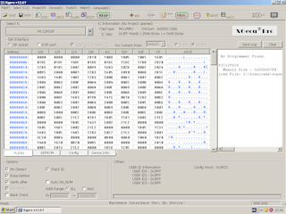](images/Xgpro_PIC12F1629.png?raw=1)

Then, start the Xgpro software, select the PIC12F629 IC, load
"supercic-key_p12f629.hex", and program the PIC. It is important to realize that
the .hex-File contains three parts, the Flash (code) section with the firmware,
the EEPROM (persistent memory) section with the PAL/NTSC flag, and the Fuses.
The Xgpro software will programm all three sections in one go, but when you use
another programmer and software combination, you might have to program these
three parts separately. Either way, carefully check that all parts got
programmed correctly, otherwise the cartridge will not work.

## Programming Cartridge Images on the EPROM

[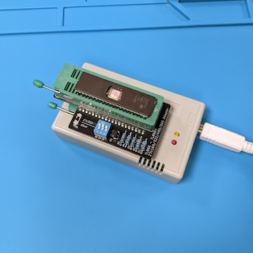](images/Programming_the_EPROM.jpg?raw=1)

Now, we will programm the EPROM with the cartridge images. First of all, you
have to think about the layout of your cartridge images on the EPROM. This
depends on the size of your images and the size of your EPROM.

When you use a 27C400 EPROM, you have one single slot of 512 KiB where you can
program one single image with up to 512 KiB.

When you use a 27C800 EPROM, you have two slots of 512 KiB each. You can fill
these slots with two images of up to 512 KiB, one image in slot 1, and another
image in slot 2. Or you can fill these slots with one single image of up to 1
MiB that occupies both slots 1 and 2.

When you use a 27C160 EPROM, you have four slots of 512 KiB each. You can fill
these slots with four images up to 512 KiB, one image in each of the four slots.
Or you can fill these slots with two images of up to 1 MiB, one in slots 1 and
2, and the other in slots 3 and 4. You can also mix two images of 512 KiB with
one image of 1 MiB, with the two 512 KiB images in slots 1 and 2, and the 1 MiB
image in slots 2 and 3, or the other way round (the 1 MiB image in slots 1 and
2, and the two 512 KiB images in slots 3 and 4). Keep in mind that the start of
the 1 MiB image must be aligned to 1 MiB, i.e. putting a 1 MiB image into slots
2 and 3 is not possible! Finally, you can fill the slots with one single image
of up to 2 MiB that occupies slots 1, 2, 3 and 4.

As an example, I will programm a 27C160 EPROM (4 slots) for a test cartridge.
This cartridge will consist of the the following three cartridge images:

1. The "NTF 2.5 Test Cartridge", available here:

   https://tcrf.net/NTF_2.5_Test_Cartridge

   This is a 1 MiB image and will occupy slots 1 and 2.

2. The "Burn-in / Test Cartridge", available here:

   https://tcrf.net/Burn-in_-_Test_Cartridge

   This is a 512 KiB image and will occupy slot 3.

3. The "240p Test Suite", available here:

   https://artemiourbina.itch.io/240p-test-suite

   This is a 512 KiB image and will occupy slot 4.

My TL866 programmer is not able to programm the kinds of EPROMs needed for the
cartridge, but there are adapters available. I'm using the adapter from this
project:

https://github.com/mafe72/27c160-tl866-adapter

There are other alternatives available, for example this project:

https://github.com/keirf/pcb-projects/wiki/EPROM-Adapter-v4

Put the adapter into the TL866, and put the EPROM into the adapter as shown in
the image above.

These adapters are not able to programm the 27C160 in one single pass, instead
you have to write chunks of 512 KiB, which coincides nicely with our slots of
512 KiB. You have to set switches on the adapter to program the chunks into the
right location on the EPROM, but this depends on the adapter you are using. Have
a look into the manual for your adapter. The whole procedure is quite tedious,
and you have to be fully concentrated not to make an error. The slightest error,
and you have to clear your EPROM in your UV eraser and start over from the
beginning!

[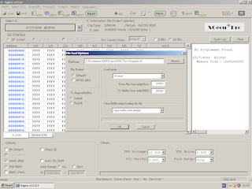](images/Xgpro_Program_Slot1.png?raw=1)

In the Xgpro software, select the "AT27C4096 @DIP40" IC. Yes, this is not the
EPROM we are using, but this is the way these adapters work. The 27C4096 is a
512 KiB EPROM that uses the same programming algorithm than our 27C160, and we
use it to program our 27C160 with chunks of 512 KiB. We have to deselect "Check
ID" for obvious reasons as well as "Pin Detect", and we have to set "Puls Delay"
to "50us". Finally, we have to adjust "VPP Voltage", have a look into the
datasheet for your EPROM. The datasheet for my STM M26C160 says that the
programming voltage has be "12.00V".

Now load the cartridge image for the first slot, in our case the "NTF 2.5 Test
Cartridge". This image is 1 MiB, i.e. it is too large, but this is not a
problem, Xgpro will automatically remove the surplus 512 KiB. Configure your
adapter for writing the first slot, and program the image.

[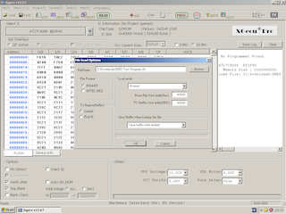](images/Xgpro_Program_Slot2.png?raw=1)

Now we have to program the second half of the "NTF 2.5 Test Cartridge" into the
second slot. Again load the cartridge image, but in the file load dialog, set
the "From File Start Addr(Hex)" to "40000" (this is 512 KiB in [hexadecimal
notation](https://en.wikipedia.org/wiki/Hexadecimal)). Leave all the other
settings as for the first slot, configure your adapter for the second slot, and
program the second half of the image.

[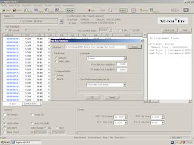](images/Xgpro_Program_Slot3.png?raw=1)

Now we have to program the "Burn-in / Test Cartridge" into the third slot. Load
the image, and make sure that in the file load dialog the "From File Start
Addr(Hex)" is set back to "00000". Leave all the other settings as for the first
two slots, configure your adapter for the third slot, and program the image.

[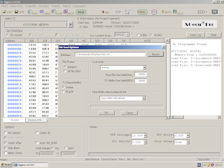](images/Xgpro_Program_Slot4.png?raw=1)

Finally, we have to program the "240p Test Suite" into the fourth slot. You know
the drill. Load the image, leave all the other settings as before, configure
your adapter for the fourth slot, and program the image. Finished!

## Using the Cartridge and Troubleshooting

[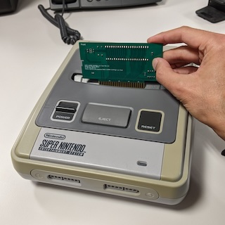](images/Using_the_Cartridge.jpg?raw=1)

When you do not install your cartridge into a cartridge shell, you have to be
extremly careful when inserting the cartridge. Especially, you have to mind the
orientation: It is a little bit counter intuitive, but you have to insert the
cartridge backwards, with the components on the cartridge facing the back side
of the console! Also keep in mind that the cartridge slot in the console is much
wider than the edge connector of the cartridge because it has extension pins on
both sides that the cartridge does not use, so make sure to insert your
cartridge properly into the center section of the cartridge slot. And when you
remove the cartridge, do not use the eject button, and be careful that the
cartridge does not get stuck in the cover that protects the cartridge slot!

When you have more than one cartridge image programmed on your EPROM, you can
use the dip switches on the cartridge to select the image to start. To start
a given image on the EPROM, you have the select the slot where the image starts
with the two DIP switches:

* To select the image that starts at slot 1, switch both A18 and A19 to "on".

* To select the image that starts at slot 2, switch A18 to "off" and and A19 to
  "on".

* To select the image that starts at slot 3, switch A18 to "on" and and A19 to
  "off".

* To select the image that starts at slot 4, switch both A18 and A19 to "off".

| Slot 1                           | Slot 2                           | Slot3                            | Slot4                            |
|----------------------------------|----------------------------------|----------------------------------|----------------------------------|
|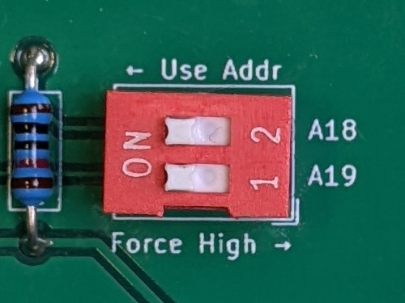|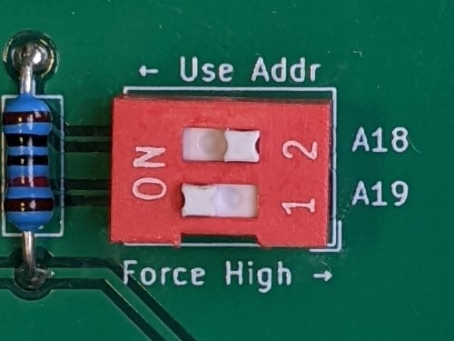|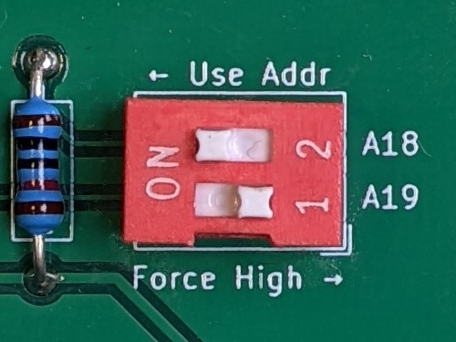|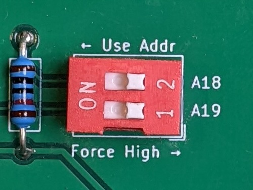|

As an example, lets have a look at the example cartridge we programmed in the
previous section. First, we want to start the "NTF 2.5 Test Cartridge". This
image starts in slot 1. So we have to move both DIP switches for A18 and A19 to
the "on" position.

Now we want to start the "Burn-in / Test Cartridge". This image starts in slot
3. So we have to move the DIP switch for address line A18 to "on", and the
DIP switch for address line A19 to "off".

Finally we want to start the "240p Test Suite". This image starts in slot 4. So
we have to move both DIP switches for A18 and A19 to the "off" position.

What happens when we select slot 2 on this cartridge, i.e. when we switch A18 to
"off" and A19 to "on"? Well, we will probably just get a black screen, because
we try to start a cartridge image in the middle of the "NTF 2.5 Test Cartridge",
and the console immediately crashes.

When the cartridge does not work, there are two different failure modes:

1. You do not get a video signal at all. This means that the PIC12F629 on the
   cartridge was not able to unlock the SNES. When you have a PAL (european)
   SNES and try to use the cartridge for the first time, this is actually
   normal, because the firmware on the PIC simulates a NTSC (american) lockout
   chip. Simply press Reset or powercycle the console, it should automatically
   switch to PAL when the unlock sequence fails. When this does not help, check
   if the firmware is burned correctly to your PIC and that the orientation of
   the PIC on the cartridge is correct (the notch on the chip should face to
   the center of the cartridge). Also check your soldering.

2. You get a video signal, but the screen is all black or completly garbled.
   This means that the SNES is not able to correctly read the contents of the
   EPROM. Usually that can be fixed by wiggling the cartridge carefully a little
   bit in the slot. When that does not work, remove the cartridge an try to
   clean the edge connector, especially remove any flux that might be left over
   from soldering the cartridge. When this also does not help, you have to check
   that the EPROM is correctly programmed, that it has the right orientation
   (the notch should face the DIP switches), and that you set the DIP switches
   correctly. Also check your soldering.

## License

SNES LoROM Cartridge w/o Save (c) by Patrick Dähne

SNES LoROM Cartridge w/o Save is licensed under a
Creative Commons Attribution-NonCommercial-ShareAlike 4.0 International License.

You should have received a copy of the license along with this
work. If not, see <https://creativecommons.org/licenses/by-nc-sa/4.0/>.
